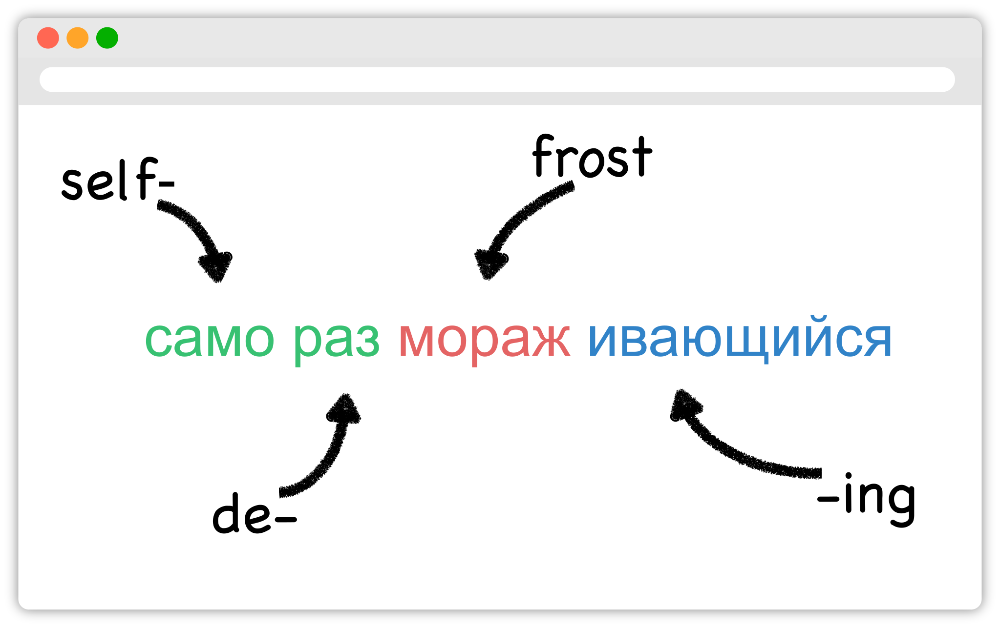

# 📣 Welcome to the Rootski codebase!

This is the codebase for the application running at [rootski.io](https://www.rootski.io).

> 🗒 Note: You can find information and training on the architecture, ticket board, development practices, and how to contribute
on our [knowledge base](https://quickest-trail-808.notion.site/Rootski-Knowledge-Base-49bb8843b6424ada9f49c22151014cfc).

Rootski is a full-stack application for studying the Russian language by learning roots.

Rootski uses an A.I. algorithm called a "transformer" to break Russian words into roots. Rootski enriches
the word breakdowns with data such as definitions, grammar information, related words, and examples
and then displays this information to users for them to study.

## How is the Rootski project run? (Hint, [get involved here](https://quickest-trail-808.notion.site/Rootski-Knowledge-Base-49bb8843b6424ada9f49c22151014cfc) 😃)

Rootski is developed by volunteers!

We use Rootski as a platform to learn and mentor anyone with an interest in
frontend/backend development, developing data science models,
data engineering, MLOps, DevOps, UX, and running a business. Although the code is open-source,
the license for reuse and redistribution is tightly restricted.

The premise for building Rootski "in the open" is this: possibly the best ways to learn to write
production-ready, high quality software is to

1. explore other high-quality software that is already written
2. develop an application meant to support a large number of users
3. work with experienced mentors

For better or worse, it's hard to find code for large software systems built to be hosted in
the cloud and used by a large number of customers. This is because virtually all apps that fit
this description... are proprietary 🤣. That makes (1) hard.

(2) can be inaccessible due to
the amount of time it takes to write well-written software systems without a team (or mentorship). If you're only interested
in a sub-part of engineering, or if you are a beginner, it can be infeasible to build an entire production
system on your own. Think of this as working on a personal project... with a bunch of other fun people
working on it with you.

## Contributors

Onboarded and contributed features :D

- [Eric Riddoch](ericriddoch.info) - Been working on Rootski for 3 years and counting!
- [Ryan Gardner](https://www.linkedin.com/in/gardner-ryan/) - Helping with all of the legal/business aspects and dabbling in development

## Friends

Completed a lot of the Rootski onboarding and chat with us in our [Slack workspace](https://join.slack.com/t/rootskiio/shared_invite/zt-13avx8j84-mocJVx5wFAGNf5wUuy07OA) about miscellanious code questions, careers, advice, etc.

- [Isaac Robbins](https://www.linkedin.com/in/isaacrobbins/) - Learning and building experience in MLOps and DevOps!
- [Colin Varney](https://www.linkedin.com/in/colin-varney-b7283135/) - Full-stack python guy. Is working his first full-time software job!
- [Fazleem Baig](https://www.linkedin.com/in/fazleem-baig/) - MLOps guy. Quite experienced with Python and learning about AWS. Working for an AI startup in Canada.
- [Ayse (Aysha) Arslan](https://www.linkedin.com/in/ayse-seyyide-arslan-5b1594137/) - Learning about all things MLOps. Working her first MLE/MLOps job!
- [Sebastian Sanchez](https://www.linkedin.com/in/sebbsanchez/) - Learning about frontend development.
- [Yashwanth (Yash) Kumar](https://www.linkedin.com/in/yashpkumar/) - Finishing up the Georgia Tech online masters in CS.

</br></br></br></br></br>

## The Technical Stuff

### How to deploy an entire Rootski environment from scratch

Going through this, you'll notice that there are several one-time, manual steps. This is common even for teams
with a heavily automated infrastructure-as-code workflow, particularly when it comes to the creation of users
and storing of credentials.

Once these steps are complete, all subsequent interactions with our Rootski infrastructure can be done
using our infrastructure as code and other automation tools.

#### 1. Create an AWS account and user

1. Create an IAM user with programmatic access
2. Install the AWS CLI
3. Run `aws configure --profile rootski` and copy the credentials from step (1). Set the region to `us-west-2`.

> 🗒 Note: this IAM user will need sufficient permissions to create and access the infrastructure that will
be discussed below. This includes creating several types of infrastructure using CloudFormation.

#### 2. Create an SSH key pair

1. In the AWS console, go to EC2 and create an SSH key pair named `rootski`.
2. Download the key pair.
3. Save the key pair somewhere you won't forget. If the pair isn't already named, I like to rename them and store them at `~/.ssh/rootski/rootski.id_rsa` (private key) and `~/.ssh/rootski/rootski.id_rsa.pub` (public key).
4. Create a new GitHub account for a "Machine User". Copy/paste the contents of `rootski.id_rsa.pub` into any boxes you have to to make this work :D
this "machine user" is now authorized to clone the rootski repository!

#### 3. Create several parameters in AWS SSM Parameter Store

| Parameter      | Description |
| ----------- | ----------- |
| `/rootski/ssh/private_key`      | The contents of the private key needed to clone the `rootski` repository.       |
| `/rootski/prod/database_config`   | A stringified JSON object with database connection information (see below) |

```json
{
    "postgres_user": "rootski-db-user",
    "postgres_password": "rootski-db-pass",
    "postgres_host": "database.rootski.io",
    "postgres_port": "5432",
    "postgres_db": "rootski-db-database-name"
}
```

#### 4. Purchase a domain name that happens to be `rootski.io`

You know, the domain name `rootski.io` is hard coded in a few places throughout the Rootski infrastructure.
It felt wasteful to parameterize this everywhere since... it's unlikely that we will ever change our domain name.

If we ever have a need for this, we can revisit it :D

#### 5. Create an ACM TLS certificate verified with the DNS challenge for `*.rootski.io`

You'll need to do this in the AWS console. This certificate will allow us to access `rootski.io`
and all of its subdomains over HTTPS. You'll need the ARN of this certificate for a later step.

#### 4. Create the rootski infrastructure

Before running these commands, copy/paste the ARN of the `*.rootski.io` ACM certificate
into the appropriate place in `infrastructure/iac/cloudformation/front-end/static-website.yml`.

```bash
# create the S3 bucket and Route53 hosted zone for hosting the React application as a static site
...

# create the AWS Cognito user pool
...

# create the AWS Lightsail instance with the backend database (simultaneously deploys the database)
...

# deploy the API Gateway and Lambda function
...
```

#### 5. Deploy the frontend site

```bash
make deploy-frontend
```

DONE!
